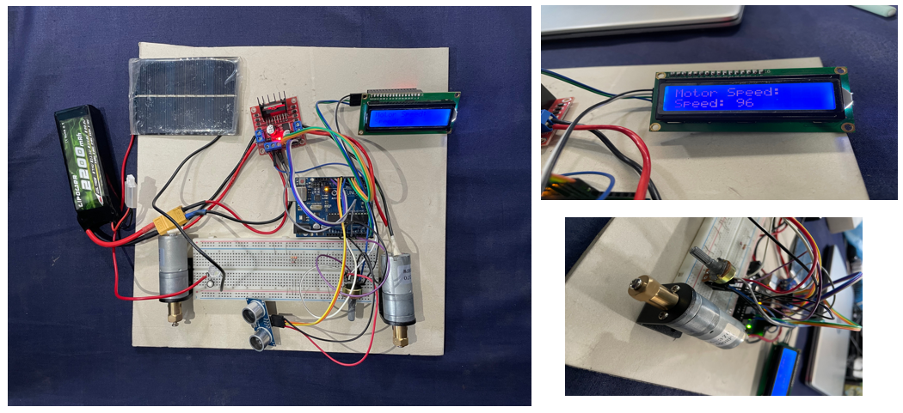
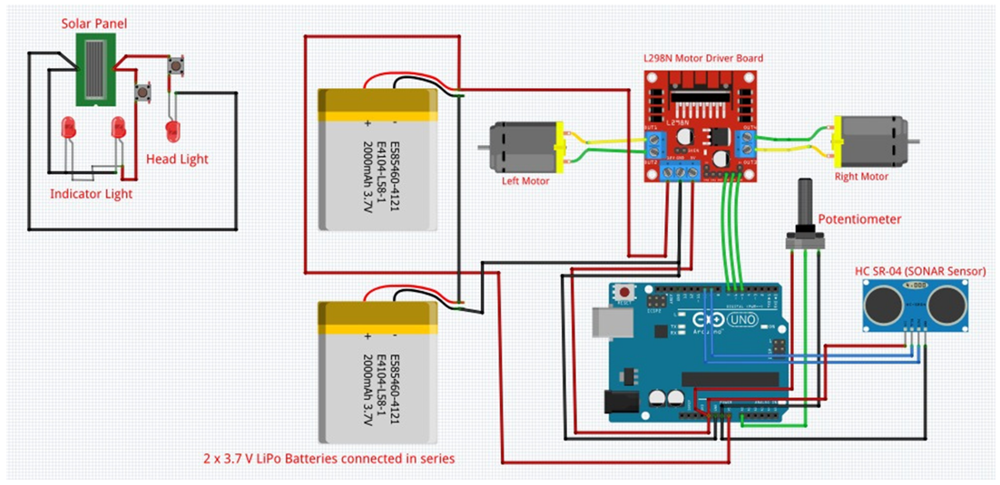
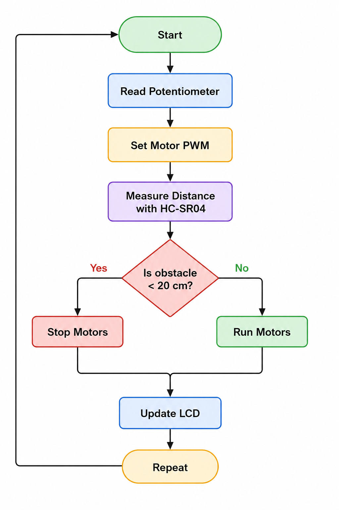

# Enhanced Battery Rickshaw Arduino Prototype — EEE 4518

An Arduino-based hardware prototype developed to explore practical **safety and energy-efficiency enhancements for battery-powered rickshaws**. The system integrates manual PWM motor control, ultrasonic obstacle detection with automatic stopping, LCD feedback, dual DC-motor control, and solar-assisted auxiliary functionality.

**Course:** EEE 4518  
**Project Type:** Open-ended Real-Life Engineering Problem  
**Team:** Team MurubbEEE

---

## Overview

Battery-powered rickshaws are widely used for short-distance transportation in Bangladesh. However, conventional battery rickshaws often have limited safety features, basic driver feedback, and high dependence on externally charged batteries.

This project explored several engineering modifications through a **physical hardware prototype** controlled by an Arduino.

The final prototype incorporated:

- Arduino-based control
- Driver-controlled PWM motor speed
- Dual DC-motor operation
- Ultrasonic obstacle detection
- Automatic motor stopping
- LCD information display
- Solar-panel integration
- Auxiliary lighting
- Hardware-level implementation and testing

---

## Problem Statement

The project was motivated by several issues associated with conventional battery-powered rickshaws:

- Uncontrolled or excessive speed
- Risk of collision
- Limited safety systems
- High electricity consumption
- Lack of driver information systems
- Limited use of renewable energy sources

The objective was to demonstrate how embedded electronics, sensors, motor control, and renewable-energy concepts could be integrated into a prototype platform.

---

## Hardware Prototype

<p align="center">
  
</p>

The physical prototype integrates the Arduino controller, motor driver, two DC motors, ultrasonic sensor, LCD, potentiometer-based driver input, solar panel, and supporting electronics.

---

## Circuit Schematic

The circuit schematic was designed using **Fritzing**.

<p align="center">
  
</p>

The editable Fritzing project is available here:

[`Fritzing/l298n-arduino.fzz`](Fritzing/l298n-arduino.fzz)

---

# Implemented Features

## 1. Manual Motor Speed Control

A potentiometer connected to Arduino analog input `A0` acts as the driver's motor-speed command.

The Arduino reads the analog input and converts it into a PWM command for the L298N motor driver.

The PWM output is limited to:

```text
0 – 178
```

rather than the complete Arduino 8-bit PWM range of `0 – 255`.

Both DC motors receive the corresponding PWM command through the L298N motor driver.

> **Note:** The displayed speed value represents the motor PWM command, not an actual vehicle-speed measurement in km/h.

---

## 2. Obstacle Detection

An **HC-SR04 ultrasonic sensor** is mounted at the front of the prototype to measure the distance to nearby obstacles.

The Arduino continuously calculates the distance using the ultrasonic sensor.

The implemented safety threshold is:

```text
20 cm
```

If an obstacle is detected within approximately 20 cm, the system automatically stops both motors.

---

## 3. Automatic Motor Stopping

The motor-control logic follows:

```text
If distance < 20 cm:
    Stop both motors

Otherwise:
    Run motors according to potentiometer input
```

This provides a basic collision-avoidance mechanism for the prototype.

---

## 4. LCD Information Display

A **16×2 LCD with an I2C adapter** is used to provide information to the driver.

The display shows the motor-speed command generated from the potentiometer input.

I2C communication reduces the number of Arduino pins required for the LCD.

---

## 5. Dual-Motor Drive

Two DC geared motors are driven through an **L298N dual H-bridge motor driver**.

The Arduino controls:

- Motor direction
- Motor enable signals
- PWM speed command

Both motors are configured to move the prototype forward during normal operation.

---

## 6. Solar Integration

A small solar panel was incorporated into the prototype as part of the proposed renewable-energy enhancement.

The prototype demonstrates the concept of using solar energy for auxiliary electrical loads.

It does **not** implement a complete solar battery-charging system or maximum-power-point-tracking controller.

---

# System Control Flow

<p align="center">
  
</p>

The Arduino control process can be summarized as:

```text
Start
  ↓
Read Potentiometer
  ↓
Set Motor PWM
  ↓
Measure Distance with HC-SR04
  ↓
Is obstacle < 20 cm?
  ├── Yes → Stop Motors
  └── No  → Run Motors
  ↓
Update LCD
  ↓
Repeat
```

---

# Arduino Pin Connections

| Component | Signal | Arduino Pin |
|---|---|---:|
| HC-SR04 | Trigger | 9 |
| HC-SR04 | Echo | 10 |
| L298N Motor A | ENA / PWM | 5 |
| L298N Motor A | IN1 | 6 |
| L298N Motor A | IN2 | 7 |
| L298N Motor B | ENB / PWM | 11 |
| L298N Motor B | IN3 | 8 |
| L298N Motor B | IN4 | 12 |
| Potentiometer | Wiper | A0 |
| I2C LCD | SDA | A4 |
| I2C LCD | SCL | A5 |

A **common ground** is required between the Arduino, L298N, sensors, display, and motor power supply.

Detailed wiring information is available here:

[`Docs/Pin_Connections.docx`](Docs/Pin_Connections.docx)

---

# Arduino Firmware

The main Arduino source code is available at:

[`Arduino/TotalProjectCodeRickshaw.ino`](Arduino/TotalProjectCodeRickshaw.ino)

The firmware performs:

- Analog potentiometer reading
- PWM motor-speed command generation
- Dual-motor control
- Motor-direction control
- HC-SR04 distance measurement
- Obstacle detection
- Automatic motor stopping
- LCD updates
- I2C communication

---

## Required Arduino Libraries

The firmware uses:

```cpp
#include <Wire.h>
#include <LiquidCrystal_I2C.h>
```

`Wire` is included with the Arduino platform.

A compatible **LiquidCrystal_I2C** library must be installed before compiling the project.

---

# How to Run

## 1. Hardware Setup

Connect the components according to:

```text
Docs/Pin_Connections.docx
```

Important connections include:

```text
HC-SR04:
Trig → Pin 9
Echo → Pin 10

Motor A:
ENA → Pin 5
IN1 → Pin 6
IN2 → Pin 7

Motor B:
ENB → Pin 11
IN3 → Pin 8
IN4 → Pin 12

Potentiometer:
Wiper → A0

LCD:
SDA → A4
SCL → A5
```

---

## 2. Upload the Firmware

1. Open **Arduino IDE**.
2. Open:

```text
Arduino/TotalProjectCodeRickshaw.ino
```

3. Install a compatible `LiquidCrystal_I2C` library if necessary.
4. Select the correct Arduino board.
5. Select the correct serial port.
6. Compile the program.
7. Upload it to the Arduino.

---

## 3. Test the System

Rotate the potentiometer to change the motor-speed command.

Move an object in front of the HC-SR04 sensor.

When the measured distance becomes less than approximately:

```text
20 cm
```

both motors should automatically stop.

Remove the obstacle and the motors should resume operation according to the potentiometer input.

---

# Main Hardware Components

The prototype uses the following major components:

| Component | Quantity |
|---|---:|
| Arduino Uno | 1 |
| L298N Dual H-Bridge Motor Driver | 1 |
| HC-SR04 Ultrasonic Sensor | 1 |
| DC Gear Motors | 2 |
| 16×2 LCD | 1 |
| I2C LCD Adapter | 1 |
| Potentiometer | 2 |
| Solar Panel | 1 |
| LiPo Battery / Power Supply | 1 |
| LED / Auxiliary Lighting | 1 |
| Jumper Wires and Connecting Hardware | As required |

The initial component estimate created during project planning is preserved in:

[`Archive/initial_component_budget.txt`](Archive/initial_component_budget.txt)

---

# Project Documentation

The project documentation is available in the [`Docs`](Docs/) directory.

## Final Project Report

[`EEE4518_Final_Project_Report.pdf`](Docs/EEE4518_Final_Project_Report.pdf)

The report documents the completed project, including:

- Problem identification
- Project objectives
- Component selection
- Circuit design
- Working principle
- Arduino implementation
- Hardware implementation
- Problems encountered
- Final prototype
- Conclusion
- References

---

## Project Proposal

[`EEE4518_Project_Proposal.pdf`](Docs/EEE4518_Project_Proposal.pdf)

The original proposal contains the initial project concept and the broader set of enhancements considered during the planning stage.

---

## Pin Connections

Detailed wiring and Arduino pin assignments are available in:

[`Docs/Pin_Connections.docx`](Docs/Pin_Connections.docx)

---

## Progress Updates

Intermediate development documentation is available in:

[`Docs/Progress_Updates/`](Docs/Progress_Updates/)

---

# Presentation

The final project presentation is available in the [`Presentation`](Presentation/) directory.

Files:

- [`Team-MurubbEEE-Final-Presentation.pdf`](Presentation/Team-MurubbEEE-Final-Presentation.pdf)
- [`Team-MurubbEEE-Final-Presentation.pptx`](Presentation/Team-MurubbEEE-Final-Presentation.pptx)

---

# Repository Structure

```text
Enhanced-Battery-Rickshaw-Arduino-Prototype-EEE4518/
│
├── README.md
│
├── Archive/
│   └── initial_component_budget.txt
│
├── Arduino/
│   └── TotalProjectCodeRickshaw.ino
│
├── Docs/
│   ├── Progress_Updates/
│   ├── EEE4518_Final_Project_Report.pdf
│   ├── EEE4518_Project_Proposal.pdf
│   └── Pin_Connections.docx
│
├── Figures/
│   ├── circuit_schematic.png
│   ├── hardware_prototype.png
│   └── system_flowchart.png
│
├── Fritzing/
│   └── l298n-arduino.fzz
│
└── Presentation/
    ├── Team-MurubbEEE-Final-Presentation.pdf
    └── Team-MurubbEEE-Final-Presentation.pptx
```

---

# Project Evolution

The original proposal considered several possible enhancements, including:

- Speed sensing
- Automatic response to overspeeding
- Obstacle detection
- Solar integration
- Reverse/recovery charging
- Lighting
- Driver information display

Not every proposed feature was implemented in the final prototype.

The completed hardware prototype focused on:

- Potentiometer-based motor-speed command
- PWM motor control
- HC-SR04 obstacle detection
- Automatic stopping
- LCD feedback
- Dual-motor control
- Solar-assisted auxiliary integration

Separating the **proposed features** from the **implemented features** provides a more accurate representation of the completed engineering work.

---

# Current Limitations

This prototype was developed as an educational proof of concept and has several limitations:

- No wheel encoder or Hall-effect sensor for actual vehicle-speed measurement
- No calibrated speed measurement in km/h
- LCD displays the PWM control command rather than actual vehicle speed
- No battery state-of-charge monitoring
- No regenerative braking implementation
- No reverse-charging implementation
- No closed-loop motor-speed control
- No production-grade braking actuator
- No complete solar charge controller
- Fixed prototype-scale obstacle threshold
- L298N motor driver is appropriate for the prototype but not for a full-scale rickshaw traction motor

Therefore, this project should be considered a **prototype demonstration**, not a road-ready vehicle control system.

---

# Possible Future Improvements

Future versions of the system could include:

- Wheel-speed sensing using a Hall sensor or encoder
- Calibrated speed measurement in km/h
- Closed-loop speed control
- Speed-dependent stopping distance
- Battery voltage and current monitoring
- Battery state-of-charge estimation
- Dedicated solar charge controller
- Higher-efficiency motor controller
- Regenerative braking
- Indicator and headlight automation
- Data logging
- Wireless telemetry
- Full-scale braking-system integration
- Vehicle-level safety testing

---

# Team

This project was developed by **Team MurubbEEE**:

- Ar-Rafi Ishraq
- Ishrak Anan
- Taufeeq Hassan Omio
- Ashfiq Ul Rahman
- Tahsik Islam Sampad
- Bayzid Mohammed Sakib


---

# Tools and Technologies

- Arduino Uno
- Arduino IDE
- Embedded C/C++
- Fritzing
- Tinkercad during development
- HC-SR04 ultrasonic sensing
- L298N H-bridge motor driver
- PWM motor control
- I2C communication
- 16×2 LCD
- DC motor control
- Hardware prototyping
- Soldering and circuit assembly

---

# Academic Context

This project was completed as an **open-ended engineering project for EEE 4518**.

The objective was to identify a real-world problem and use engineering knowledge to design and implement a practical solution.

The selected problem was the enhancement of battery-powered rickshaws through embedded control, safety sensing, driver feedback, and renewable-energy concepts.

---

# Repository Maintainer

**Ar-Rafi Ishraq**  
Electrical and Electronic Engineering
